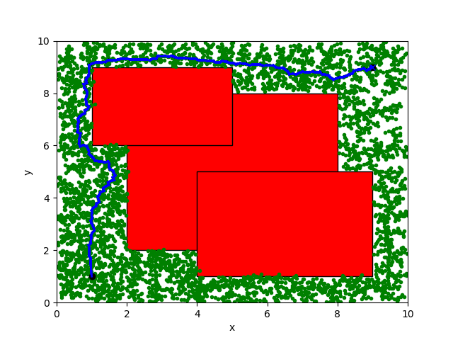
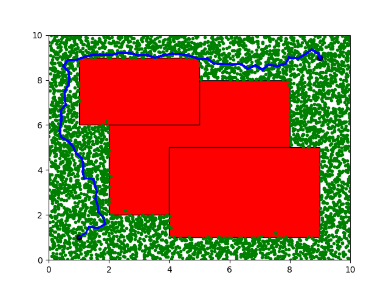

Run python lattice_planning.py

config to use different planner inside lattice planner

Motion premitive for Bestfirst

Run python rrt_diff.py

RRT diff plt

Run python rrt_particle.py
RRT_particle plt

Run python rrt_star_particle.py
RRT_start_particle

